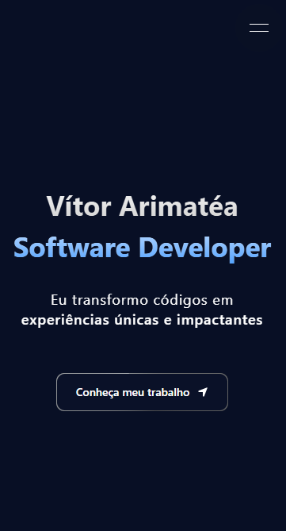

<h1>Vítor Arimatéa - Portfólio</h1>
<h3>Desenvolvedor de Software Full Stack</h3>

Um espaço para apresentar minhas habilidades, experiências e principais projetos

 

🖥️ <strong>Versão Desktop</strong>

  

📱 <strong>Versão Mobile</strong>

  

---

## 🧑🏻‍💻 Tecnologias Utilizadas

Frameworks, libs e linguagens utilizadas no projeto:

- [Next.js](https://nextjs.org/)
- [TypeScript](https://www.typescriptlang.org/)
- [Tailwind](https://tailwindcss.com/)
- [Shadcn](https://ui.shadcn.com/)
- [Aceternity](https://ui.aceternity.com/)
- [SCSS](https://sass-lang.com/)
- [Motion](https://motion.dev/)

---

## 🧠 Sobre o Projeto

Este portfólio foi criado com o objetivo de ser uma vitrine interativa do meu trabalho como desenvolvedor. Aqui, você encontrará:

- 🧑‍💻 Um pouco sobre mim e minha jornada na programação
- 🛠️ Meus projetos favoritos com foco em performance, usabilidade e segurança
- 🎨 Uma interface moderna e responsiva, com Dark Mode

Este projeto representa minha evolução como profissional e minha dedicação em oferecer soluções completas, escaláveis e com uma ótima experiência de usuário.

---

## 🔗 Acesse o Portfólio

👉 Acessar: [vitorarimatea.com.br](https://vitorarimatea.com.br/)

---

## 📬 Contato

Se quiser trocar uma ideia, dar alguma sugestão ou contratar meus serviços:

- Email: contato@vitorarimatea.com.br
- LinkedIn: [linkedin.com/in/vitorarimatea](https://linkedin.com/in/vitorarimatea)

---

  Feito realmente com muito 💙 por Vítor Arimatéa

