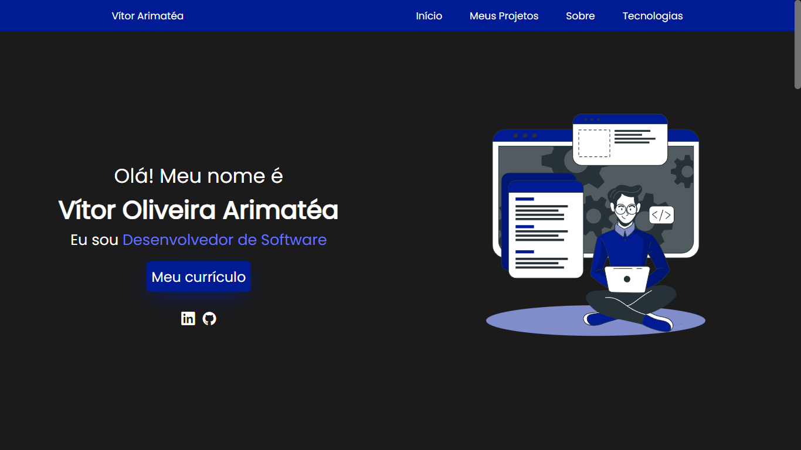
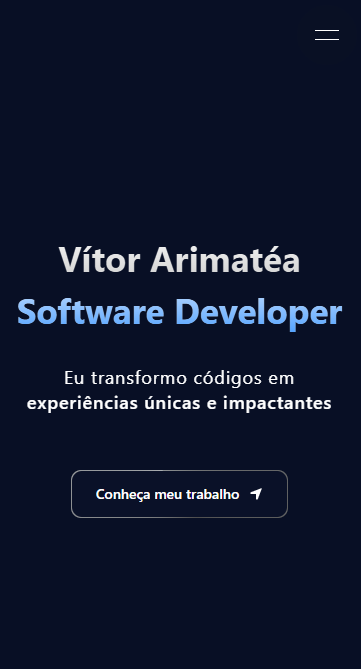

<h1 align="center">Vítor Arimatéa Portfolio 2025 - Software Developer</h1>

Versão Desktop

  

Versão Mobile
  

    

#

## Tecnologias

Para desenvolver esse projeto eu utilizei as seguintes tecnologias:
 

- Next.js, React, TypeScript, TailwindCSS e SCSS.

## Projeto

Meu Portfólio Pessoal, uma vitrine para demonstrar todo o meu conhecimento, um pouco sobre mim e os meus melhores projetos.

## Visualizar

Link para visualizar meu portfólio: 
