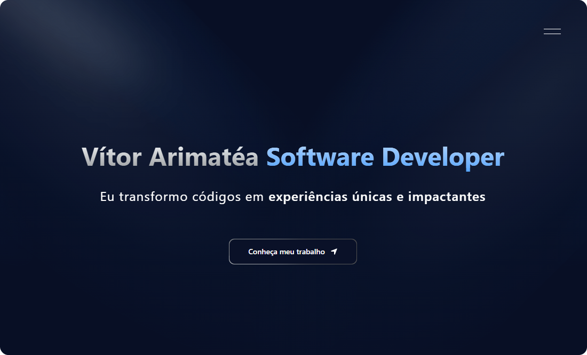

# Vítor Arimatéa

### Software Engineer

**Transformo ideias** em **soluções digitais completas**, com foco em **experiência do usuário**, **arquitetura escalável**, **performance**, **segurança**, **acessibilidade** e **código sustentável**.

_Explore meu portfólio para conhecer meus principais projetos, experiências e habilidades._

## Tecnologias Utilizadas

- **Next.js**
- **TypeScript**
- **Tailwind CSS + Shadcn/UI + Aceternity**
- **Framer Motion**
- **SCSS**

---

## Sobre o Projeto

Meu portfólio foi pensado em ser como uma **vitrine interativa e profissional**, destacando:

- **Projetos:** destacando os mais importantes da minha carreira;
- **Minha jornada:** um pouco sobre mim e minha experiência;
- **Habilidades:** tecnologias que eu utilizo no dia a dia;

## Confira meu Porfólio

👉🏻 **[vitorarimatea.vercel.app](https://vitorarimatea.vercel.app/)**

---

## Vamos Conversar?

Se quiser **trocar uma ideia, sugerir melhorias ou contratar meus serviços**:

**LinkedIn:** [linkedin.com/in/vitorarimatea](https://linkedin.com/in/vitorarimatea)

---

### Criado e mantido com muita dedicação por **Vítor Arimatéa**

_"Sonhe. Crie. Alcance."_

