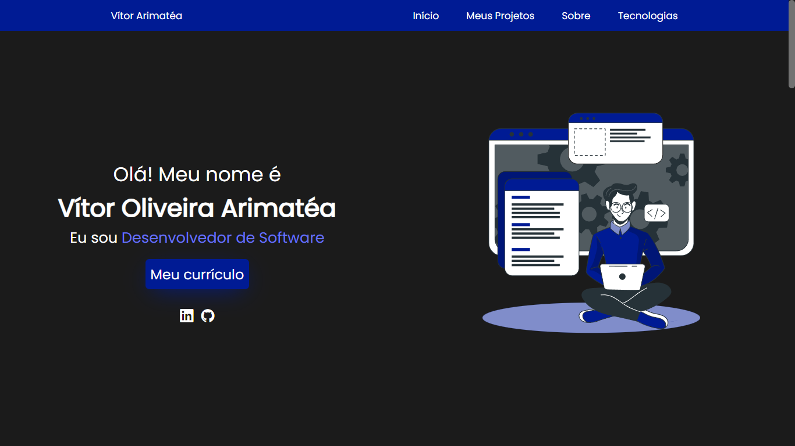
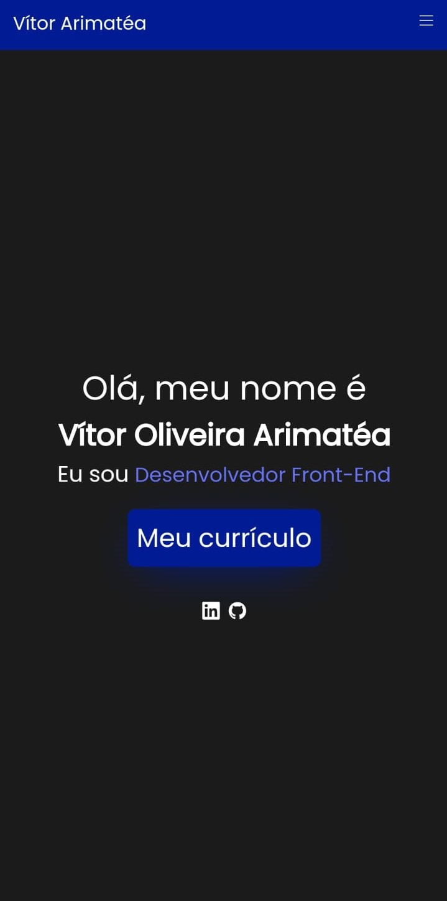

<h1 align="center">Meu portfólio</h1>

Versão PC

  

Versão Mobile
  

    

#

## Tecnologias

Para desenvolver esse projeto eu utilizei as seguintes tecnologias:
 

- HTML, CSS e JavaScript.

## Sobre

Um cantinho com minha personalidade. Onde minha história, realizações e todos os meus projetos mais legais irão ficar.

## Deploy

Link para acessar o projeto: https://vitorarimatea.github.io/personal-portfolio