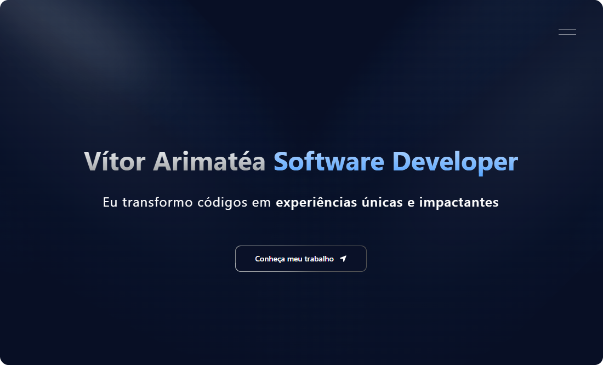

# **Vítor Arimatéa**
### Desenvolvedor Full Stack

Transformo ideias em **soluções digitais completas**, unindo **Front-End, Back-End e UX** para criar experiências funcionais e envolventes. com total foco em entregar **produtos modernos, performáticos e seguros**.  

*No meu portfólio você encontrará os meus principais projetos, habilidades e experiências.*

## Tecnologias Utilizadas

- **Next.js**
- **TypeScript**
- **Tailwind CSS + Shadcn/UI + Aceternity**
- **Framer Motion**
- **SCSS**

---

## Sobre o Projeto

Meu portfólio foi pensado em ser como uma **vitrine interativa e profissional**, destacando:

- **Minha jornada:** um pouco sobre mim e minha experiência;
- **Projetos reais:** com foco em usabilidade, segurança e escalabilidade;
- **UI/UX moderna e responsiva:** alinhada às tendências atuais.

## Dê uma olhada no meu Portfólio

➡️ **[vitorarimatea.vercel.app](https://vitorarimatea.vercel.app/)**

---

## Vamos Conversar?

Se quiser **trocar uma ideia, sugerir melhorias ou contratar meus serviços**:
 
- **LinkedIn:** [linkedin.com/in/vitorarimatea](https://linkedin.com/in/vitorarimatea)

---

### Criado e mantido com muita dedicação por **Vítor Arimatéa**  
_"Sonhe. Crie. Alcance."_

